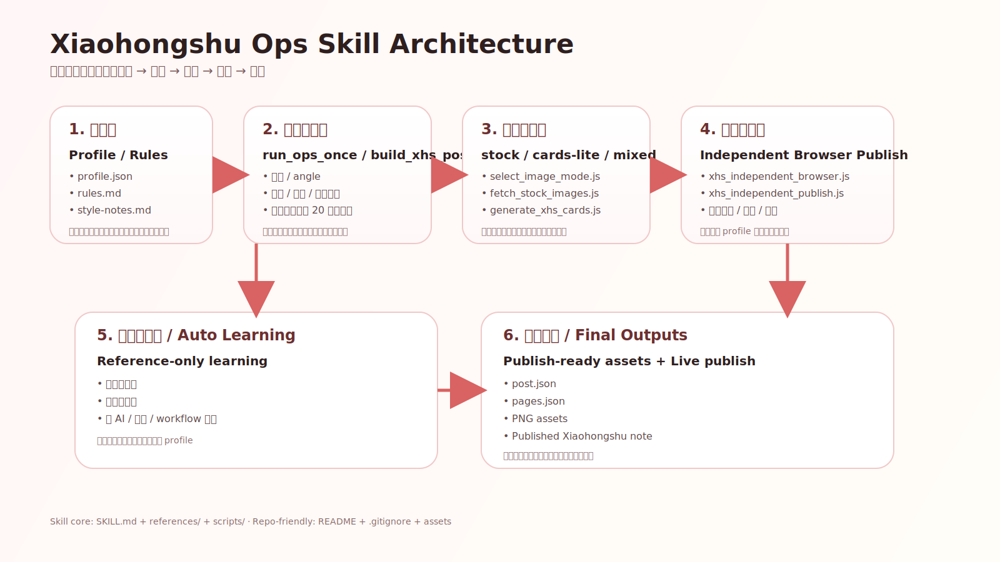

# Xiaohongshu Ops

> 中文说明：见 [README.md](./README.md)

An OpenClaw skill for **automated Xiaohongshu operations**, covering profile setup, content generation, image generation, publishing, and reference learning.



---

## What this is

`xiaohongshu-ops` is a single-skill repository for automated Xiaohongshu operations, not just a one-off posting script.

It is designed to consolidate the full Xiaohongshu workflow into one skill:
- configure account-level operating rules
- read local rules and learning notes
- generate titles, body copy, and page structure
- choose image strategy and generate visual assets
- publish via a dedicated browser flow
- keep learning title, image, and trend patterns in reference mode

---

## Core capabilities

### 1. Automated operating profile setup
- Configure a reusable Xiaohongshu operating profile
- Read local rules and style notes from `data/xiaohongshu/`
- Manage title/body limits, image mode, auto-learning settings, and publish preferences

### 2. Automated content generation
- Orchestrate the workflow from topic / angle to publish-ready assets
- Generate Xiaohongshu-style titles, body copy, and page structure
- Support mixed Chinese/English title rewriting within 20 characters
- Keep body length within the configured limit

### 3. Automated image asset generation
- Support image modes: `stock`, `cards-lite`, `mixed`
- Prefer real relevant imagery first and use lightweight cards as fallback
- Produce `post.json`, `pages.json`, and PNG output directories as publish assets

### 4. Automated Xiaohongshu publishing
- Publish through the dedicated independent browser flow
- Use a dedicated browser profile to avoid mixing with the user's daily browser
- Fit into a fully automated publishing pipeline

### 5. Automated reference learning
- Support daily reference-only auto learning
- Learn title patterns, image style patterns, and relevant trends
- Do not silently mutate the main profile; keep learning outputs as local reference material

---

## Directory layout

```text
xiaohongshu-ops/
├── README.md
├── README.en.md
├── SKILL.md
├── .gitignore
├── assets/
│   └── xiaohongshu-ops-architecture.svg
├── references/
└── scripts/
```

Suggested local runtime data directory:

```text
data/xiaohongshu/
├── profile.json
├── rules.md
└── style-notes.md
```

---

## File responsibilities

### `SKILL.md`
Main skill entrypoint and instructions for the agent.

### `references/`
On-demand reference docs for workflow, rules, image sourcing, and publish details.

### `scripts/`
Low-freedom helper scripts for deterministic and repeatable execution.

### `assets/`
Static assets used for repository presentation or output.

### `data/xiaohongshu/`
Local runtime configuration layer; it does not have to be published with the skill.

---

## Key scripts

- `scripts/init_profile.js` — initialize/update profile
- `scripts/run_ops_once.js` — run one full Xiaohongshu ops cycle
- `scripts/build_xhs_post.js` — assemble post assets
- `scripts/select_image_mode.js` — choose image strategy
- `scripts/build_image_pipeline.js` — build the image generation/source pipeline
- `scripts/fetch_stock_images.js` — fetch or plan stock-image candidates
- `scripts/generate_xhs_cards.js` — generate cards
- `scripts/xhs_independent_publish.js` — publish via dedicated browser profile

---

## Operating boundaries

- Prefer real relevant images first; use cards as fallback
- Do not remove watermarks or instruct watermark removal
- Treat auto learning as reference-only; do not silently rewrite the main profile
- Generated runtime outputs are temporary working files, not a long-term local content library

---

## Standalone repository usage

If you want to manage only this directory as its own Git repository:

```bash
cd skills/xiaohongshu-ops
git init
```

Recommended:
1. Keep the local `.gitignore` in this folder
2. Keep runtime account config outside this repo, or publish only sanitized examples
3. Document the expected local `data/xiaohongshu/` layout in the repository homepage

---

## Notes

- Do not commit temporary upload/test outputs
- Do not commit browser profiles or authenticated runtime state
- If you publish profile examples, review them for account-specific or private operating preferences first
